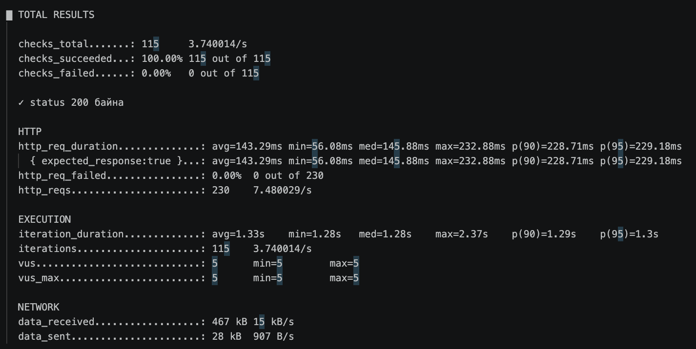
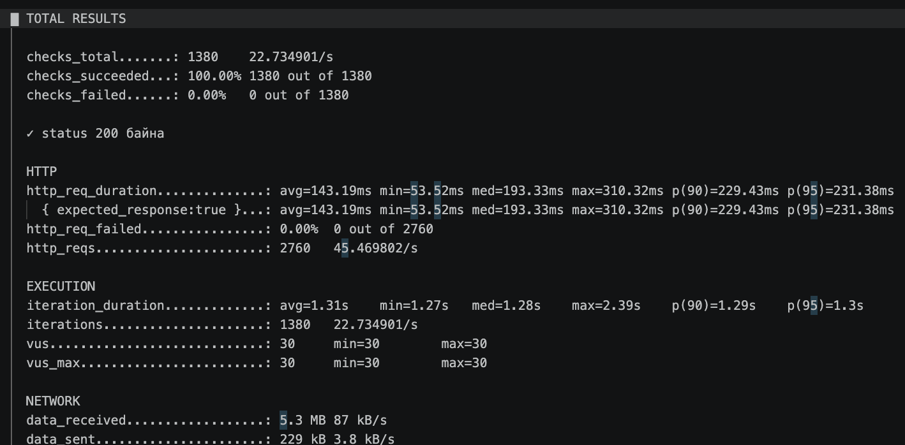
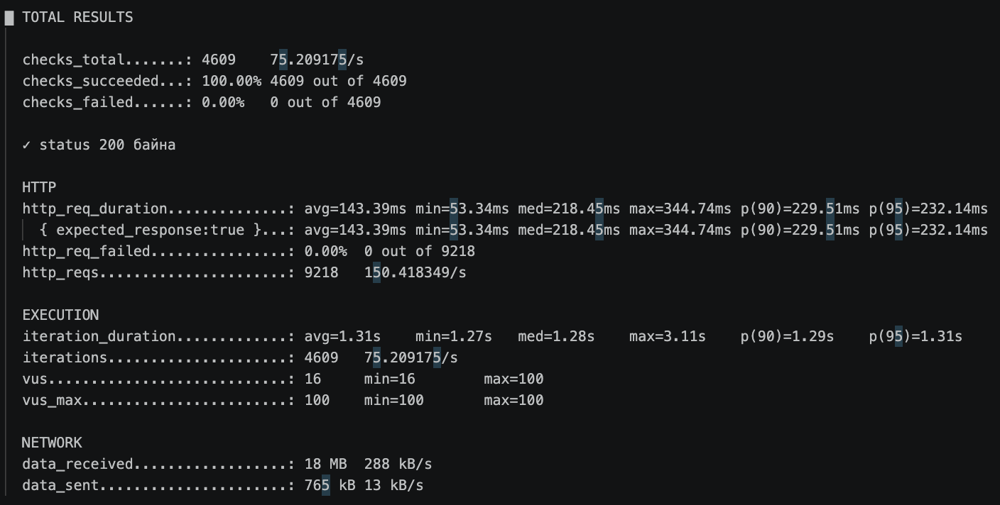
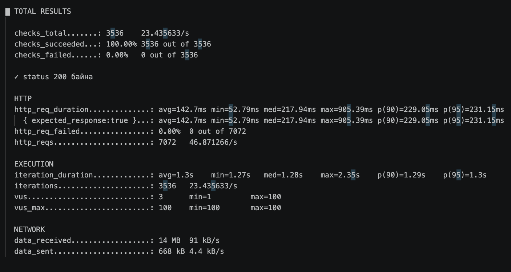
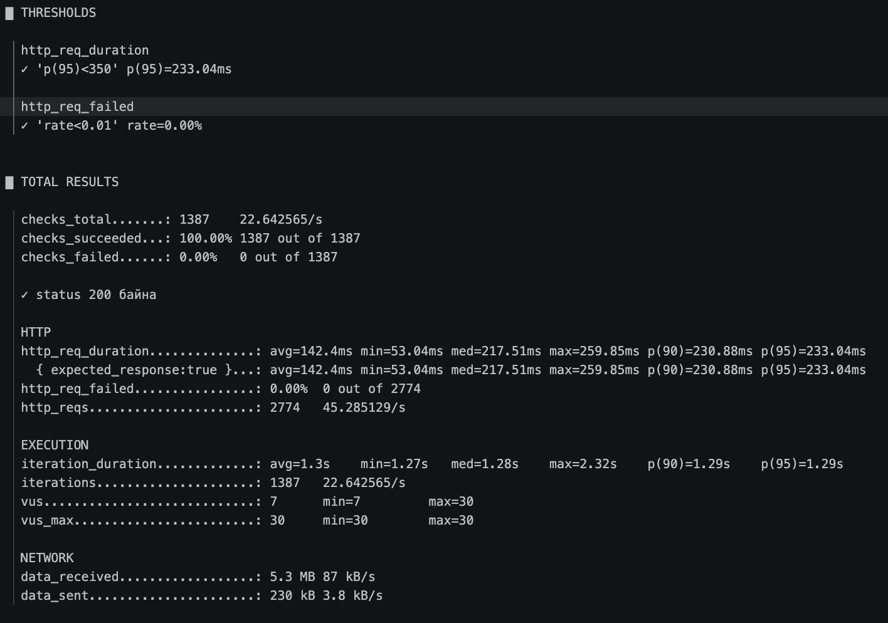
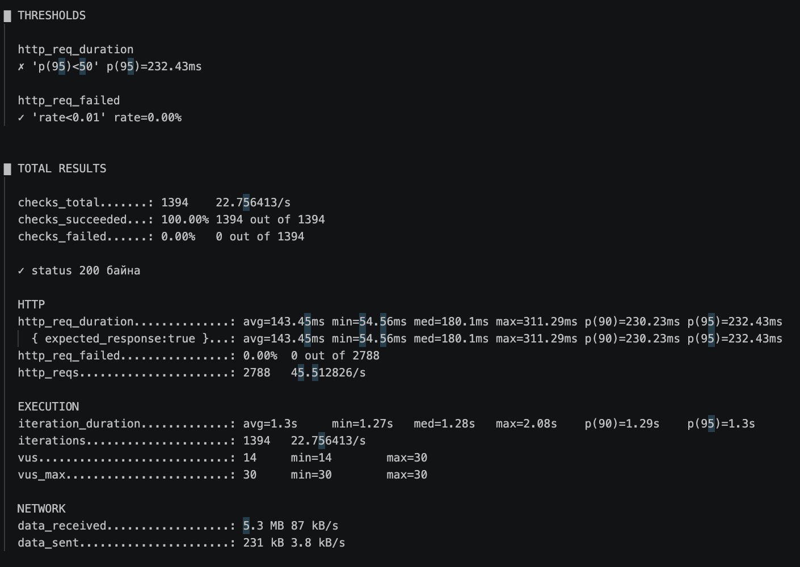

# Lab 02 — k6 Performance Testing

**Оюутан:** Ц.Бэлгүтэй
**Оюутны код:** B232270053

## Зорилго

Энэ лабораторийн зорилго нь k6 ашиглан веб хүсэлтийн latency, throughput болон error rate-ийг хэмжих явдал юм. Ачааллыг 5, 30, 100 VU түвшинд туршиж, хэрэглэгчийн тоо өсөхөд системийн гүйцэтгэл хэрхэн өөрчлөгдөж байгааг харьцуулав.

## Test target

Load test-ийн бай:

```text
https://test.k6.io
```

Зөвшөөрөгдсөн дадлагын сайт ашигласан бөгөөд зөвшөөрөлгүй бодит систем рүү тест ажиллуулаагүй.

## Environment

- k6 version:

```text
k6 v2.2.0
```

- Operating system: `macOS`
- Test date: `2026-09-14`
- Script: `script.js`
- Results directory: `results/`

## Basic test

Үндсэн тест дараах хэлбэрээр ажилласан (гурван түвшинг ижил 1 минутын duration-оор харьцуулах боломжтой болгохын тулд 5 VU-г бас 1 минутаар ажиллуулав):

```bash
k6 run --vus 5   --duration 1m script.js | tee results/run-05vu.txt
k6 run --vus 30  --duration 1m script.js | tee results/run-30vu.txt
k6 run --vus 100 --duration 1m script.js | tee results/run-100vu.txt
```

Тест бүрийн бүтэн гаралт дараах файлуудад хадгалагдсан:

- `results/run-05vu.txt`
- `results/run-30vu.txt`
- `results/run-100vu.txt`





## VU comparison

| VU | p90 latency | p95 latency | Throughput | Error rate |
|---:|---:|---:|---:|---:|
| 5   | 230.27 ms | 233.15 ms | 7.60 req/s | 0.00% |
| 30  | 229.43 ms | 231.38 ms | 45.47 req/s | 0.00% |
| 100 | 229.51 ms | 232.14 ms | 150.42 req/s | 0.00% |

`p90` болон `p95` нь `http_req_duration` хэмжүүрээс, throughput нь `http_reqs`-ийн секундэд ногдох утгаас, error rate нь `http_req_failed` хэмжүүртэй.

## Stages test

Stages тохиргоо:

```javascript
export const options = {
  stages: [
    { duration: "30s", target: 5 },
    { duration: "1m", target: 30 },
    { duration: "30s", target: 100 },
    { duration: "30s", target: 0 },
  ],
};
```

Stages тестийн бүтэн гаралт:

```text
results/run-stages.txt
```


Stages тестээр ачаалал аажмаар 5 → 30 → 100 VU болж өсөж, дараа нь 0 болж буурсан ерөнхий хэлбэрийг ажиглав. Нийт 7072 request, дундаж throughput 46.87 req/s, p95 latency 231.15 ms, error rate 0.00% байсан бөгөөд гурван түвшний тоон харьцуулалтыг stages-ийн нийлбэр summary-ээс бус, тусдаа 5, 30, 100 VU-ийн ажиллуулалтуудаас авав.

## SLO and thresholds

SLO-г Алхам 2-т хэмжсэн **5 VU-ийн baseline**-д үндэслэв (5 VU, 1 минутын ажиллуулалт — `results/run-05vu.txt`). Энэ үед `http_req_duration`-ийн p95 latency **233.15 ms** байна.

SLO-ийн latency босгыг baseline p95 × 1.5 томьёогоор тооцов:

```
SLO threshold = baseline p95 × 1.5 = 233.15 ms × 1.5 ≈ 350 ms
```

* **Latency SLO:** `p95 < 350 ms`
* **Error rate SLO:** `< 1%`

Threshold тохиргоо (`script-threshold.js`):

```javascript
thresholds: {
  http_req_duration: ["p(95)<350"],
  http_req_failed: ["rate<0.01"],
}
```

PASS үр дүн:

```text
results/run-threshold-pass.txt
```


PASS тестэд p95 = **233.04 ms** гарсан бөгөөд `p(95)<350` болон `rate<0.01` threshold хоёулаа хангагдсан (✓).

Санаатайгаар хатуу threshold ашигласан FAIL үр дүн (baseline-аас гараагүй, зориудаар боломжгүй утга сонгосон):

```text
results/run-threshold-fail.txt
```


FAIL тестэд `p(95)<50` threshold хангагдаагүй (p95 = 232.43 ms > 50 ms) тул k6 тестийг амжилтгүй гэж тэмдэглэсэн. `http_req_failed` threshold нь тус тусдаа хэвээр хангагдсан (0.00% < 1%), энэ нь k6 threshold бүрийг бие даан шалгадгийг харуулна.

## Дүгнэлт

5 VU-ийн үед (1 минутын ажиллуулалт) системийн p95 latency **233.15 ms** байсан бөгөөд үүнийг baseline гүйцэтгэлийн үзүүлэлт болгон авч, SLO-ийн латенси босгыг **350 ms** (baseline × 1.5) гэж тодорхойлов. Ачааллыг 30 VU хүртэл нэмэгдүүлэхэд throughput **7.60 req/s-ээс 45.47 req/s** болж мэдэгдэхүйц өссөн бөгөөд p95 latency харин **233.15 ms-ээс 231.38 ms** болж бага зэрэг буурсан. 100 VU-ийн үед throughput **150.42 req/s** хүрсэн бөгөөд p95 latency **232.14 ms** орчимд тогтвортой хэвээр байв. Иймээс энэхүү туршилтын хүрээнд хэрэглэгчийн тоо 20 дахин нэмэгдэхэд throughput шугаман байдлаар өссөн боловч latency бараг өөрчлөгдөөгүй нь лекц дээрх "10 хэрэглэгч 2с, 100 хэрэглэгч 4с" гэсэн жишээнээс ялгаатай — учир нь test.k6.io бол хөнгөн, статик дадлагын сайт тул 100 VU хүртэлх ачаалал серверийн чадавхийг ханган дийлэхгүй байсан гэж дүгнэж болно. Мөн 5, 30, 100 VU-ийн бүх түвшинд error rate **0.00%** байсан нь туршилтын явцад ямар ч хүсэлт алдаагүй боловсруулагдсаныг харуулж байна.

Threshold-ийн PASS тестээр baseline-аас гаргасан **350 ms** SLO хангагдсаныг (p95 = 233.04 ms) баталгаажуулж, харин зориудаар хатуу тогтоосон **p(95)<50 ms** threshold хангагдаагүй тул FAIL болсон нь k6-г CI pipeline-ийн quality gate болгон ашиглах боломжтойг харуулав. Энэ лаборатори нь throughput, latency, error rate гэсэн гурван үзүүлэлтийг бодит хэмжилтээр холбож, SLO-г "код дотор бичсэн, өөрийн baseline-д үндэслэсэн шаардлага" болгон ойлгоход тусалсан.

## Files

- `script.js`
- `script-stages.js`
- `script-threshold.js`
- `results/run-05vu.txt`
- `results/run-30vu.txt`
- `results/run-100vu.txt`
- `results/run-stages.txt`
- `results/run-threshold-pass.txt`
- `results/run-threshold-fail.txt`
- `results/screenshots/05.png`
- `results/screenshots/30.png`
- `results/screenshots/100.png`
- `results/screenshots/fail.png`
- `results/screenshots/succeed.png`
- `results/screenshots/stages.png`
